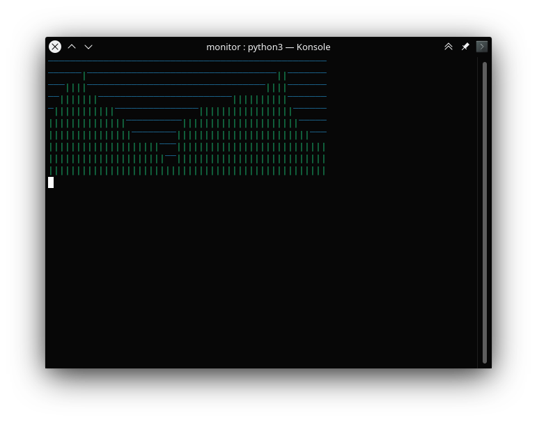
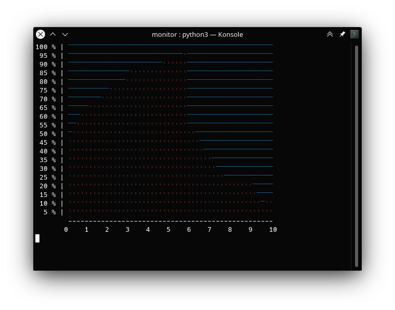

## monitor

Monitor em tempo real em formato de gráfico.

https://github.com/w-a-gomes/monitor

Exemplo 1:

```python3
import time
import os

import monitor
import status

valor_da_bolsa = status.StatusEmulator(min_value=0, max_value=10)
monitor_da_bolsa = monitor.Monitor(columns=50, lines=10)

for loop in range(70):
    os.system("clear")
    print(monitor_da_bolsa.get_as_color_str(valor_da_bolsa.get_value()))
    time.sleep(0.1)
```



Exemplo 2:

```python3
import time
import os

import monitor
import status

valor_do_bitcoin = status.StatusEmulator(min_value=0, max_value=20)
monitor_do_bitcoin = monitor.Monitor(
    columns=50, lines=20, primary_color="red-dark", primary_character="'")

for loop in range(70):
    os.system("clear")
    vertical_label_num = 100  # Números serão uma etiqueta na vertical antes do monitor
    
    for line in monitor_do_bitcoin.get_as_color_list(valor_do_bitcoin.get_value()):
        print(("  " + str(vertical_label_num))[-3:] + " % |", line)
        vertical_label_num -= 5

    print("        " + "-" * 50)  # Desenha as etiquetas da horizontal
    print("       0    1    2    3    4    5    6    7    8    9    10")
    time.sleep(0.1)
```

