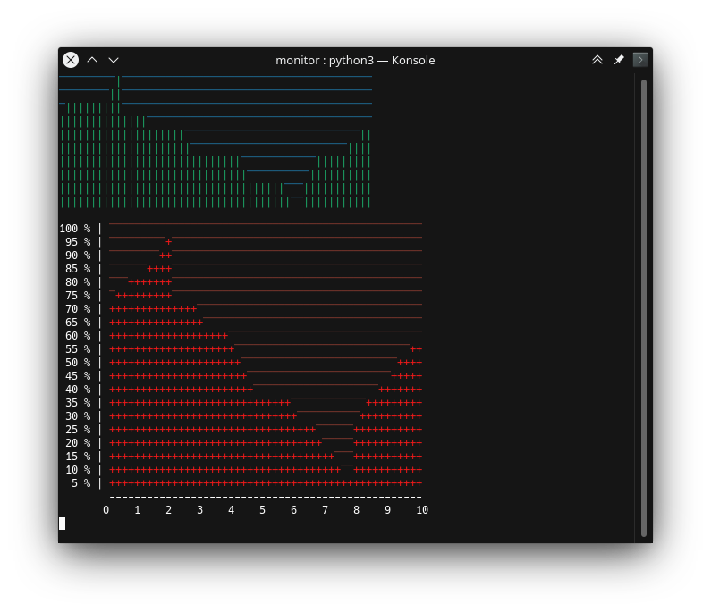

## monitor

Monitor em tempo real com forma de gráfico.

Wilden Alisson Gomes https://github.com/w-a-gomes

https://github.com/w-a-gomes/monitor

*Screenshot*



Exemplo, como na screenshot acima:

```python3
import time
import os

import monitor
import status

#  Neste teste, será gerado números aleatórios, decrementando e incrementando
# para emular números de estatísticas ou status, números que ficam com valor
# alto e depois abaixam.
#
# status = A variável status irá representar a fonte do valor estatístico.
# small_monitor = A variável small_monitor será o primeiro monitor
# big_monitor = A variável big_monitor será o segundo monitor
#
#  *Lembrete: O valor da quantidade de linha corresponde ao valor máximo do status,
# então um valor real de status deve ser dividido para quantidade de linhas do monitor
#
#  O primeiro monitor (small_monitor) é exibido em uma só string
#  O segundo monitor (big_monitor) é exibido linha por linha em um loop 'for'. Isso
# dará a capacidadede de adicionar informações antes e depois de cada linha

status = status.StatusEmulator(min_value=0, max_value=20)
small_monitor = monitor.Monitor(columns=50, lines=10)
big_monitor = monitor.Monitor(
    columns=50, lines=20, primary_color="red", secondary_color="red-dark", primary_character="+")

while True:
    os.system("clear")  # Limpar para atualizar a tela do terminal durante o loop
    real_time_value = status.get_value()  # Recebe um valor de status em tempo real

    print(
        small_monitor.get_as_color_str(          # O valor é dividido por 2, pois
            round(real_time_value / 2)) + '\n')  # este monitor tem metade da altura

    big_monitor_as_list = big_monitor.get_as_color_list(real_time_value)

    vertical_label_num = 100  # Números serão uma etiqueta na vertical antes do monitor
    for line in big_monitor_as_list:
        vertical_label_str = str(vertical_label_num)

        if vertical_label_num < 10:  # Ajuste na indentação de números menor que 10
            vertical_label_str = "  " + vertical_label_str
        elif vertical_label_num < 100:  # Ajuste na indentação de números menor que 100
            vertical_label_str = " " + vertical_label_str

        print(vertical_label_str + " % |", line)  # Exibe etiqueta e a linha do monitor
        vertical_label_num -= 5

    print("        " + "-" * 50)  # Desenha as etiquetas da horizontal
    print("       0    1    2    3    4    5    6    7    8    9    10")

    time.sleep(0.1)
```
