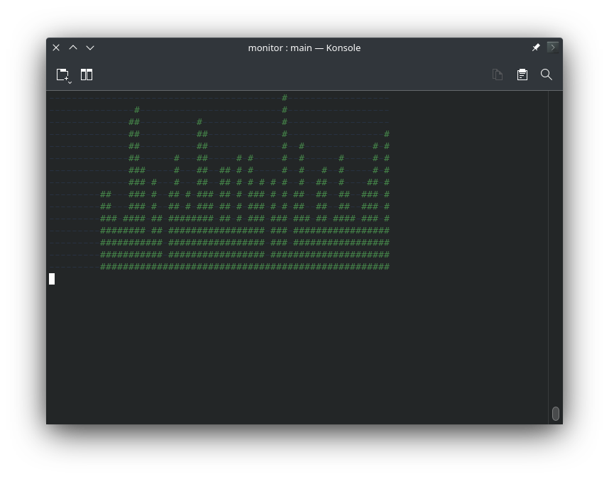
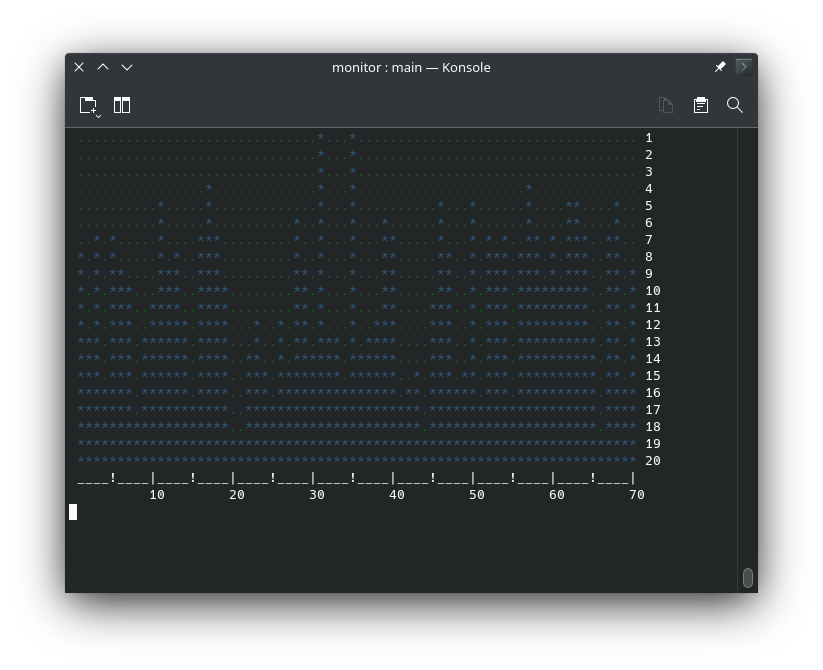

## monitor

Real-time display in graphical format written in Rust.

https://github.com/w-a-gomes/monitor

Example:

```rust
use std::time::Duration;
use std::thread::sleep;

use monitor;

fn main() {
    // Monitor settings
    let width = 60;
    let height = 15;
    let char_1 = Some('#');             // Default is *
    let char_2 = None;                  // Default is -
    let color_1 = Some((68, 131, 73));  // Default is system/terminal color
    let color_2 = Some((40, 50, 66));   // Default is system/terminal color

    // Monitor instance
    let mut monit = monitor::Monitor::new(width, height, char_1, char_2, color_1, color_2);

    // A loop controls the monitor display time
    for _ in 0..60 {  // If 'sleep' below is 1 second, then using 60 here is 1 minute in loop
        print!("{esc}[2J{esc}[1;1H", esc = 27 as char); // Clear terminal

        // Utility to emulate real-time value
        let mut bitcoin_value = monitor::ValueEmulator::new(0, height);
        
        // Show monitor
        for monitor_lines in monit.status(bitcoin_value.value()) {
            println!("{}", monitor_lines);
        }
        sleep(Duration::from_millis(100)); // Slow down display (1 second is 1000)
    }
}

```


Drawing the details

```rust
let mut monit = monitor::Monitor::new(  // Instance
    60, 15, Some('+'), None, Some((47, 87, 124)), Some((29, 79, 41)));

for _ in 0..60 {  // Display time
    print!("{esc}[2J{esc}[1;1H", esc = 27 as char);  // Clear terminal

    let mut bitcoin_value = monitor::ValueEmulator::new(0, 15);  // Real-time value

    for (n, m) in monit.status(bitcoin_value.value()).iter().enumerate() {
        println!(" {} {}", m, n + 1);  // Show row and right decoration
    }
    println!("  {}", "----|".repeat(12 as usize));  // Bottom decoration
    sleep(Duration::from_millis(100));
}
```

